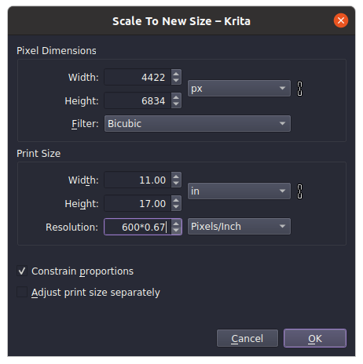

# The Koriander templates

Templates for creating comics in Krita.

Different editions incorporate the attributes published by different sources. These attributes differ from publisher to publisher and source to source, but are constructed here in a unique, simple and flexible digital format. Each edition includes a template for a single page, double page spread, and a worksheet.

The files are vector-based, so they are one size fits all. They can be easily resized to match your work requirements following the instructions for resizing below.

They are also configured to use two sets of resolutions: a working resolution, and a print resolution, reflecting IRL work with an art board. Without changing the actual pixel dimensions, the alternate working resolution allows you to work with and view the file as if it were an 11 x 17 inch board, with your target dimension reflecting the ultimate print size.

To quickly trim the page by hand, go to the TRIM layer and select TRIM TO CURRENT LAYER from the image commands in the menu.

## Editions

* Scratchmore
    
    The Scratchmore edition conform to the attributes of a popular commercial board that you'll find in any art store.

    Keep in mind however that page dimension and ratio vary from publisher to publisher and source to source, so there is no way to create one definitive comic book page template. This template simply reflects the popular commercial board, which you may find is at odds with other recommended formats.

## Resizing the board

Resizing the board means changing the actual pixel dimensions for more or less detail.

Determine your preferred target resolution, generally between 300 and 600 dpi, and use the following chart to get your working resolution. The working resolution is always 67% of the target resolution.

Target resolution   | Working resolution
------------------: | ------------------
600                 | 402
550                 | 368.5
500                 | 335
450                 | 301.5
400                 | 268
350                 | 234.5
300                 | 201

Under PRINT SIZE (do nothing in the upper PIXEL section), uncheck ADJUST PRINT SIZE SEPARATELY and enter your working resolution. The pixel width/height above should change, while the print width/height should remain 11 x 17 inches.

You can use the chart to find your working resolution, or enter the formula as shown above.

## Print resolution

Switching to the print resolution does not resize or alter the art in any way. Check ADJUST PRINT SIZE SEPARATELY and enter your print resolution. Now the pixel dimensions should remain unchanged; this only alters the relative measurements to the set pixel size.

