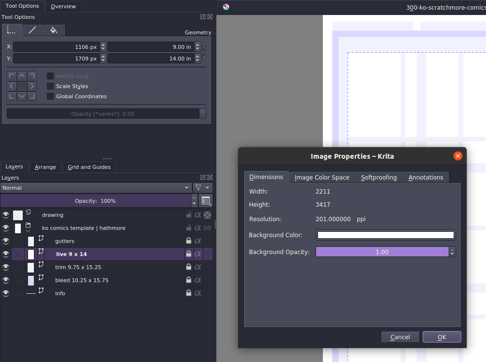
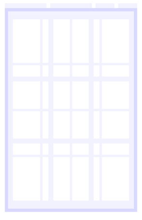
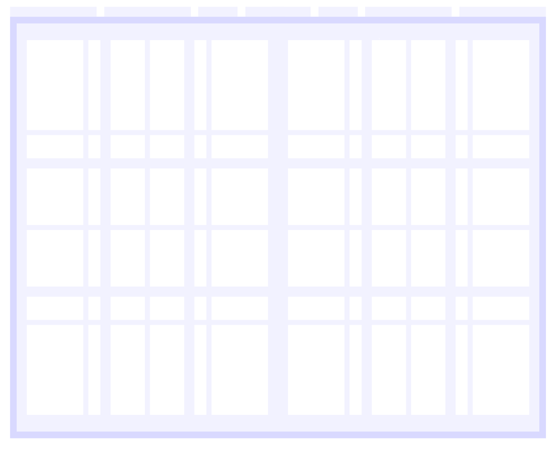
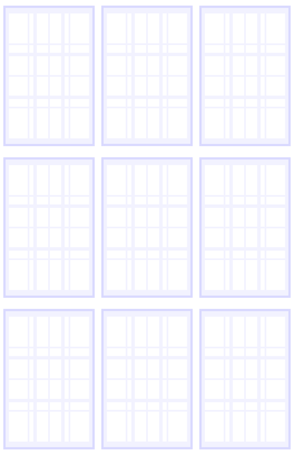
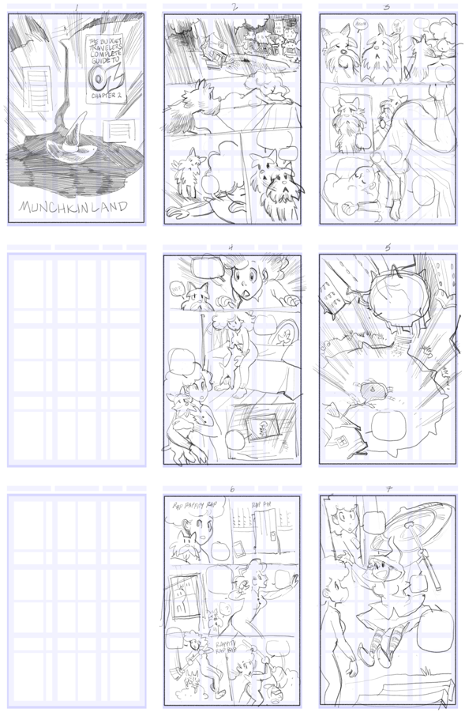
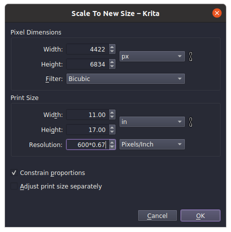
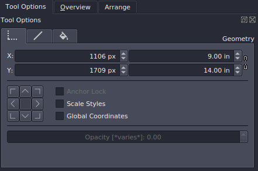

# The Koriander templates

Templates for creating comics in Krita.

## Editions

Different editions incorporate the attributes published by different sources. These attributes differ from publisher to publisher and source to source, but are constructed here in a unique, simple and flexible digital format. Each edition includes a template for a single page, double page spread, and a worksheet.

Edition                                                                                   | Source                | Live (inches) | Trim          | Bleed
----------------------------------------------------------------------------------------- | --------------------- | ------------- | ------------- | -------------
[Scratchmore](https://github.com/ko-koriander/ko-templates/tree/main/scratchmore-edition) | Commercial art board  | 9 x 14        | 9.75 x 15.25  | 10.25 x 15.75
[Damson Fatboy](https://github.com/ko-koriander/ko-templates/tree/main/damson-edition)    | Commerical art board  | 8.75 x 13.75  | 9.75 x 15     | 10.375 x 15.5
[Whambot](https://github.com/ko-koriander/ko-templates/tree/main/whambot-edition)         | Art resource website  | 9 x 14.25     | 9.75 x 15     | 10 x 15.375

The following edition's dimensions were posted as final print size, instead of a full size art board. For this edition, disregard the next section on *work vs print resolution*. The template is simply set to 300 dpi, 400 dpi, etc.

Edition                                                                               | Source                | Live (inches) | Trim          | Bleed
------------------------------------------------------------------------------------- | --------------------- | ------------- | ------------- | --------
[Ka-zam](https://github.com/ko-koriander/ko-templates/tree/main/kazam-edition)        | Art resource website  | 6.25 x 9.75   | 6.75 x 10.25  | 7 x 10.5
[Ka-zam manga](https://github.com/ko-koriander/ko-templates/tree/main/kazam-edition)  | Art resource website  | 4.5 x 7       | 5 x 7.5       | 5.5 x 7.75

Resizing and customization is OK. Check towards the bottom of this document.

## Work vs print resolution

The resolution of each template is set to 67% of the target print resolution so that the physical area can be measured like a full-size art board while working. That means that if you are used to working on an 11 x 17 inch board, you can apply the same dimensions to elements within the digital template.

When you open a template marked 300 for instance, you will see that the file is set to 201 dpi. The area measurements reflect a full-size art board.

The resolution can be changed to the conventional number, as long as the actual pixel dimensions don't change.

## Layout

The aim was an intuitive design that needs no visible text labels. There are no borders, just a series of vector shapes to define the important areas.

The comic book template is comprised of the live area, trim and full bleed. The live area is white, divided in quarters and thirds; the trim area extends just beyond these divisions. The strongest blue is the full bleed area.

The vector shapes are contained on separate layers so that they can be used to guide other actions. For instance, to quickly trim the page, go to the TRIM layer, then invoke the TRIM TO CURRENT LAYER command. That simple! The LIVE area can be copied or selected to begin building the panel borders.

The worksheet is for creating layouts of contiguous pages in whatever manner you see fit, but the idea is to reserve the first column for single pages, and the second two columns for facing pages. That is, your first row may contain pages 1, 2 and 3, with the next row leaving a blank page followed by pages 4 and 5. Such a worksheet an be invaluable for seeing the flow of action in your pages.

## Resizing the board

Resizing the board means changing the actual pixel dimensions for more or less detail.

Determine your preferred target resolution, generally between 300 and 600 dpi, and use the following chart to get your working resolution. The working resolution is always 67% of the target resolution.

Target resolution   | Working resolution
------------------: | ------------------
600                 | 402
550                 | 368.5
500                 | 335
450                 | 301.5
400                 | 268
350                 | 234.5
300                 | 201

Under PRINT SIZE (do nothing in the upper PIXEL section), uncheck ADJUST PRINT SIZE SEPARATELY and enter your working resolution. The pixel width/height above should change, while the print width/height should remain 11 x 17 inches.

You can use the chart to find your working resolution, or enter the formula as shown above.

## Print resolution

Switching to the print resolution does not resize or alter the art in any way. Check ADJUST PRINT SIZE SEPARATELY and enter your print resolution. Now the pixel dimensions should remain unchanged; this only alters the relative measurements to the set pixel size.

## Customization

If you have specific requirements (from a particular printer, for instance) you can customize the template for your own use.

Starting with really just any file you find here, click on any of the vector blocks, and switch the geometry in TOOL OPTIONS to inches (or centimeters, if you prefer).

Unlock the locked layers, change the dimensions. Recenter blocks if necessary. Edit the labels to reflect the new dimensions, re-lock the layers and be sure to save to a file with an appropriate new name.

The blocks are vector, so it doesn't matter what resolution file you use to do this. After you finish customization, you can use the chart above to adjust to any resolution.
